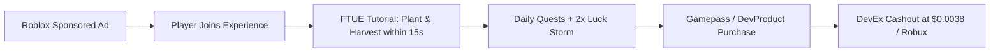

# 📊 STARWEAVE — Roblox Ads Manager Campaign Blueprint
## The High-ROI Paid Acquisition Playbook (2026 Edition)

---

### Campaign Objective
* **Goal:** Drive initial concurrent connection (CC) surge to trigger algorithmic Home page recommendation.
* **Launch Window:** **Friday, 3:00 PM EST (12:00 PM PST)** — Captures school dismissal and weekend playtime spike across North America and Europe.
* **Initial Test Budget:** **$100 – $200 USD** (equivalent to ~25,000 – 50,000 Ad Credits).

---

## 🎯 1. CAMPAIGN SETUP MATRIX

| Parameter | Configuration | Strategic Rationale |
|---|---|---|
| **Objective** | **Visits** | Maximizes direct joins; avoids wasted impressions. |
| **Placement** | **Sponsored Experiences** | Appears natively in Home page & Search results. |
| **Device Targeting** | **Mobile + Tablet (Primary)** | Mobile CPC is 40–60% cheaper than Desktop on Roblox. STARWEAVE's UI is optimized for touch. |
| **Demographics** | All Ages (9–17 priority) | High propensity for idle/gardening gameplay loops. |
| **Geography** | United States, United Kingdom, Canada, Australia | Highest ARPDAU (Average Revenue Per Daily Active User) regions for DevEx conversion. |

---

## 🚀 2. BIDDING STRATEGY

1. **Start Conservative:** Set initial Cost Per Play (CPP) bid at **0.03 – 0.05 Ad Credits**.
2. **First 2 Hours Monitoring:**
   * If spend is too slow: increment bid by 0.01 every 30 minutes until delivery reaches 80%+ pacing.
   * If spend is burning too fast: evaluate average session length before scaling budget.
3. **Target Benchmark Metrics:**
   * **Play Rate (CTR):** $> 1.8\%$ on Sponsored icon.
   * **First-Play Retention (60-sec Bounce Rate):** $< 25\%$ (handled by our anti-bounce loading screen and immediate FTUE beacon).
   * **D1 Retention:** Target $\ge 14\%$.

---

## 🎨 3. ICON & THUMBNAIL CREATIVE STRATEGY

### Game Icon Specifications (512x512 PNG)
* **Visual Focal Point:** Glowing, pulsating Celestial Bloom crop with purple and gold neon auras.
* **Background:** Deep cosmic void with subtle starfield depth.
* **Badge Overlay:** Small top-right tag: `✨ 100x LUCK EVENT`.
* **Rule:** High saturation, sharp outlines, readable at small 64x64 icon size on mobile screens.

### Thumbnail Set (1920x1080)
1. **Thumbnail 1 (Gameplay Flex):** 3D garden sanctuary with multiple colored crystal crops, floating pet wisp, and player character in cosmic pose.
2. **Thumbnail 2 (The RNG Loop):** Split comparison showing `1x Common Sprout` vs `500x Primordial Cosmic Rose`.
3. **Thumbnail 3 (The Transmutation Altar):** Dramatic purple lightning striking 3 seeds in the Forge.

---

## 📈 4. POST-CAMPAIGN RETENTION & DEVEX PIPELINE

1. **Re-investment Rule:** 50% of first weekend Robux revenue is channeled into the following Friday's Sponsored campaign to compound DAU growth.
2. **Conversion Threshold:** With an ARPDAU of 15 Robux and 5,800 DAU, the game produces 87,000 Robux daily (~$330/day), fulfilling the $10,000/month masterplan goal.
