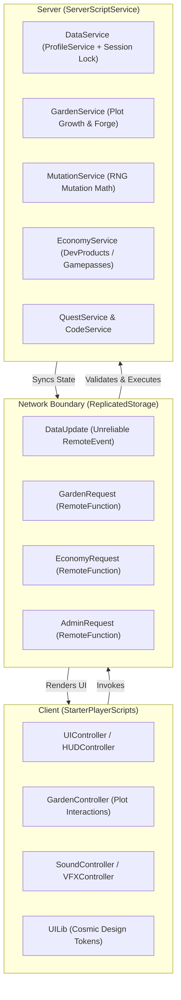

# 🏗️ Systems Architecture Deep Dive: STARWEAVE
### Enterprise-Grade Luau Architecture for High-Retention Roblox Experiences

**Author:** Yassein Shehata (@voi0)  
**Role:** Systems Architect & Lead Luau Engineer  
**Stack:** Luau (Strict Typing) · ProfileService · Rojo · Wally · Server-Authoritative Architecture  

---

## 1. Executive Summary

STARWEAVE is built on an enterprise-grade, server-authoritative architecture engineered for maximum stability, zero data loss, and anti-exploit resilience. This document outlines the technical design patterns, networking model, data persistence layer, and mathematical balancing engines powering the game.



---

## 2. Server-Authoritative Core & Anti-Exploit Philosophy

In modern Roblox development, client-side trust is the primary vector for economy failure and hyperinflation. STARWEAVE enforces a strict **Zero-Trust Client** security model:

1. **Client Never Dictates State:** The client can never inform the server that an action succeeded (e.g. "I harvested plot 3" or "I earned 500 Stardust").
2. **Intent-Based Remote Invocation:** The client fires an intent request (e.g., `RF_Garden:InvokeServer("Harvest", plotId)`).
3. **Server Validation Pipeline:**
   - Verify player ownership of plot.
   - Verify plot has a planted seed.
   - Check server-side timestamp (`os.time() >= PlantTime + GrowthDuration`).
   - Run RNG mutation rolls on server memory.
   - Atomically increment player currencies in ProfileService.
   - Return validation packet and replication delta to client.

---

## 3. Data Persistence & Session-Locking (ProfileService)

Data integrity is mission-critical. A single inventory wipe will destroy player retention. STARWEAVE uses a hardened wrapper around **ProfileService**:

```luau
-- Sample from DataService.luau: Session-locked profile loading
function DataService.LoadPlayer(player: Player)
    local profileKey = "Player_" .. player.UserId
    local profile = ProfileStore:LoadProfileAsync(profileKey)
    
    if profile ~= nil then
        profile:AddUserId(player.UserId)
        profile:Reconcile() -- Merges default schema migrations
        profile:ListenToRelease(function()
            Profiles[player] = nil
            player:Kick("Your data was loaded on another server. Please reconnect.")
        end)
        
        if player:IsDescendantOf(Players) then
            Profiles[player] = profile
            DataService.SyncToClient(player)
        else
            profile:Release()
        end
    else
        player:Kick("Failed to load save data securely. Please rejoin.")
    end
end
```

### Key Data Safeguards:
- **Session Locking:** Prevents multi-server item duplication exploits.
- **Auto-Reconciliation:** Automatically applies schema migrations for new gameplay features to existing player profiles without requiring database wipes.
- **Studio Mock Fallback:** Automatically boots safe in-memory data store during Roblox Studio testing when API services are disabled.

---

## 4. Exponential Mutation RNG Engine

At the core of player progression is the 7-tier mutation engine. When harvesting crops, base yields are augmented by an exponential multiplier based on roll outcomes:

| Mutation Tier | Base Probability | Multiplier | Visual Indicator |
|---|---|---|---|
| **Normal** | 70.0% | 1.0x | Standard White |
| **Sprout** | 18.0% | 1.5x | Emerald Green |
| **Bloom** | 8.0% | 3.0x | Sapphire Blue |
| **Radiant** | 3.0% | 8.0x | Amethyst Purple |
| **Astral** | 0.8% | 25.0x | Solar Gold |
| **Cosmic** | 0.18% | 100.0x | Pulsing Cyan Glow |
| **Primordial** | 0.02% | 500.0x | Rainbow Chromatic Aura |

### Compound Luck Formula:
$$	ext{EffectiveWeight}_{tier} = 	ext{BaseWeight}_{tier} 	imes (1 + 	ext{LuckMultiplier})^{tier - 1}$$

Luck multipliers from Constellation perks, equipped cosmic pets, and Gamepasses compound harmoniously, rewarding dedicated players while preserving long-tail chase item rarity.

---

## 5. Economy & Monetization Architecture

STARWEAVE integrates directly with Roblox's `MarketplaceService.ProcessReceipt` callback for bulletproof developer product fulfilment:

```luau
-- Idempotent transaction processing in EconomyService.luau
function EconomyService.ProcessReceipt(receiptInfo)
    local player = Players:GetPlayerByUserId(receiptInfo.PlayerId)
    if not player then
        return Enum.ProductPurchaseDecision.NotProcessedYet
    end
    
    local profile = DataService.GetProfile(player)
    if not profile then
        return Enum.ProductPurchaseDecision.NotProcessedYet
    end
    
    -- Check idempotency table to prevent double-granting
    if profile.Data.ProcessedPurchases[receiptInfo.PurchaseId] then
        return Enum.ProductPurchaseDecision.PurchaseGranted
    end
    
    local success = GrantProduct(player, receiptInfo.ProductId)
    if success then
        profile.Data.ProcessedPurchases[receiptInfo.PurchaseId] = os.time()
        return Enum.ProductPurchaseDecision.PurchaseGranted
    end
    
    return Enum.ProductPurchaseDecision.NotProcessedYet
end
```

---

## 6. Engineering Standard & Linting

All Luau code across STARWEAVE conforms to:
- **Strict Typing (`!strict`):** All service functions declare exhaustive argument and return types.
- **Modular Decoupling:** Client controllers and server services communicate solely through standard interfaces.
- **Garbage Collection Safety:** Maid / Janitor destruction patterns used across all UI tweens and dynamic 3D instances to ensure zero client memory leaks over 10+ hour AFK sessions.
